# Flutter News App
Group communication apps using Flutter and Firebase-Firestore Database

    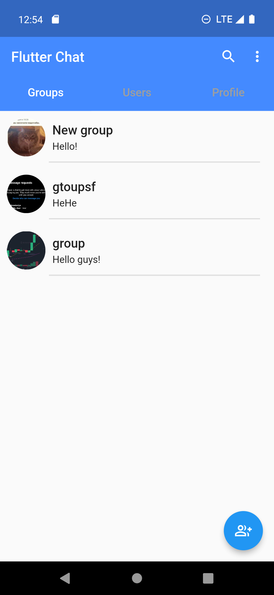
    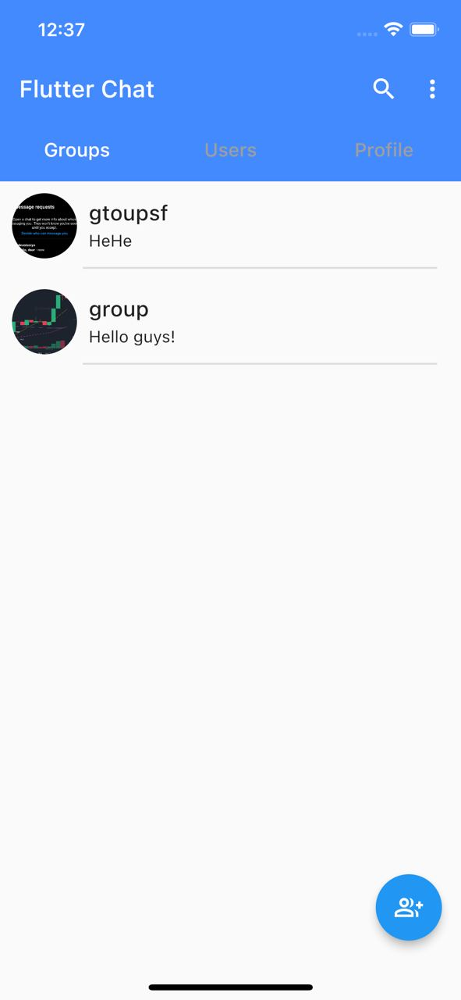
    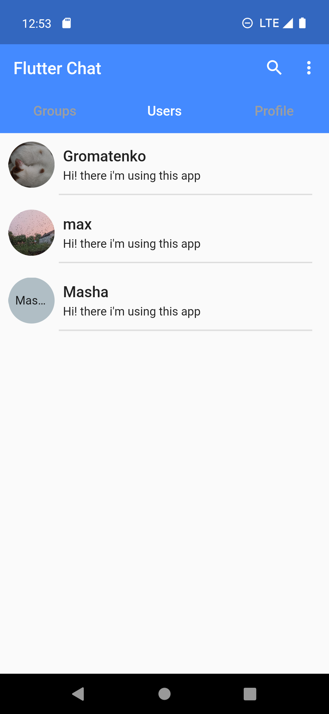
    
    
    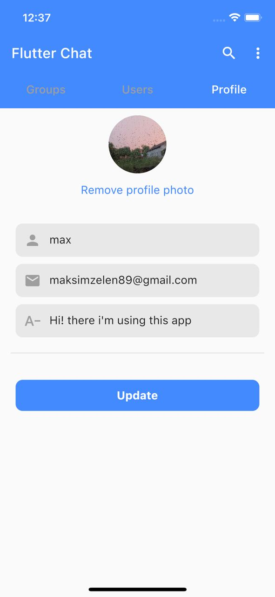 
    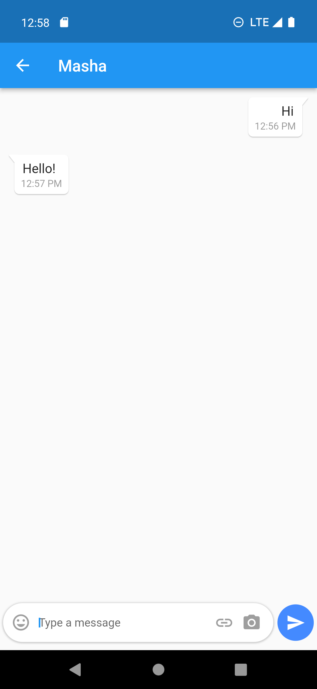
    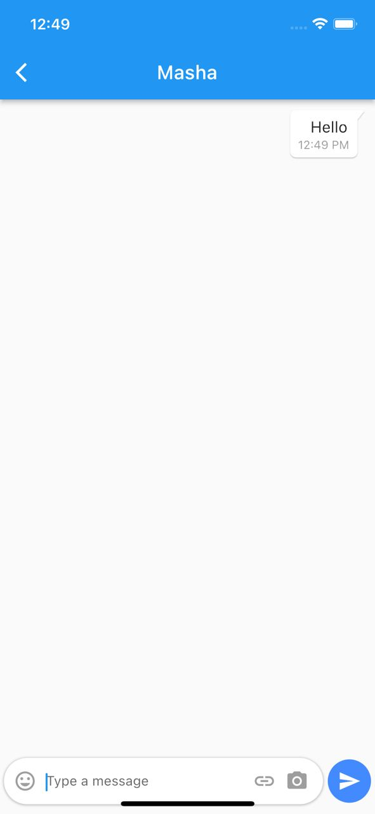 
    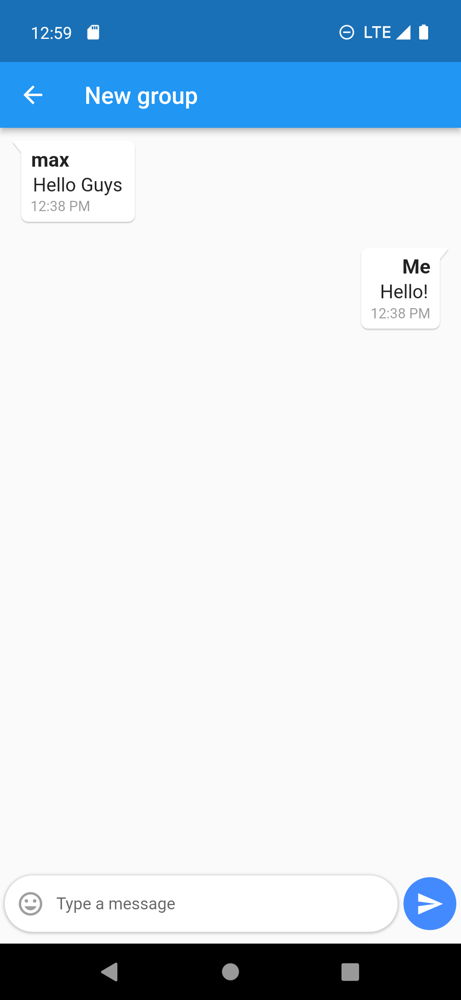
    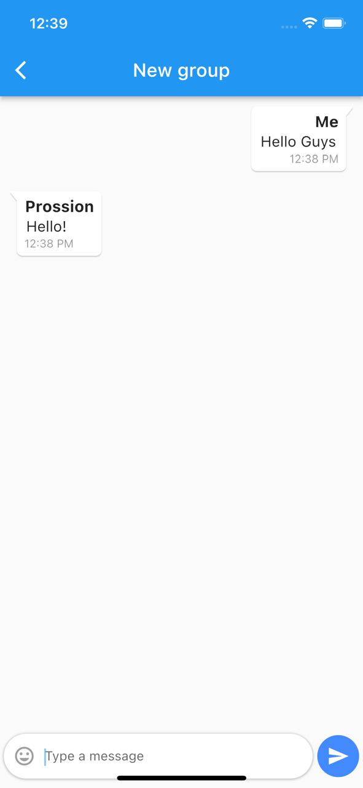 
    
    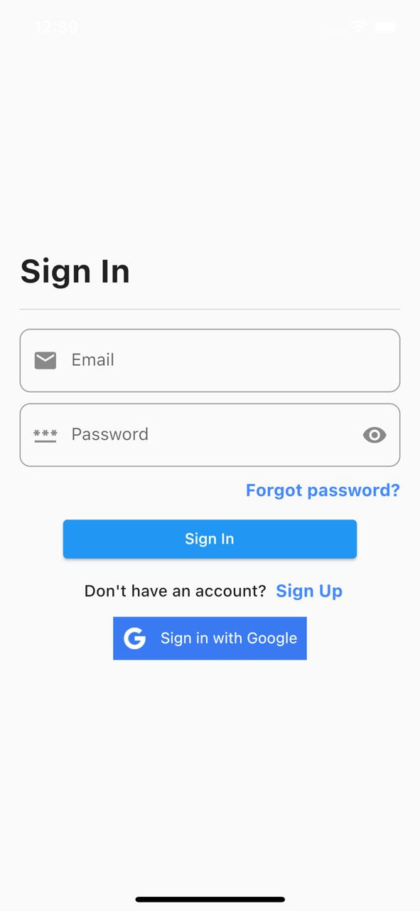 
    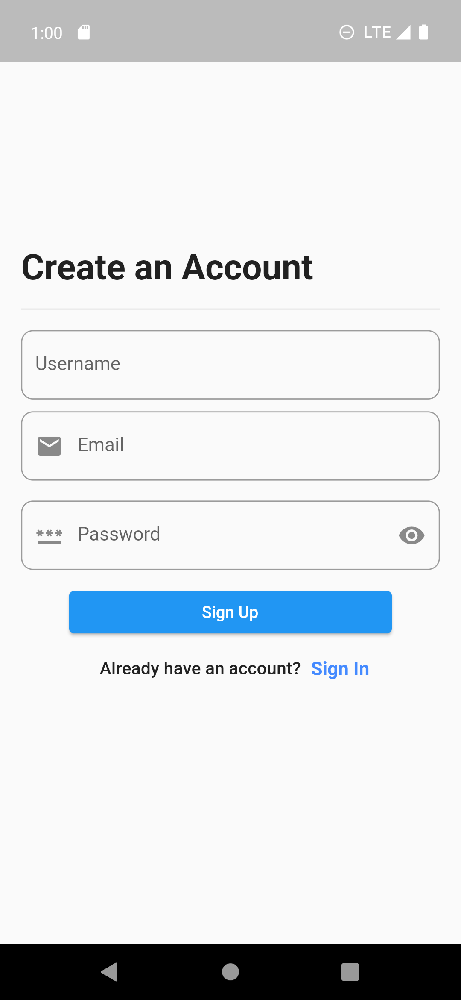
    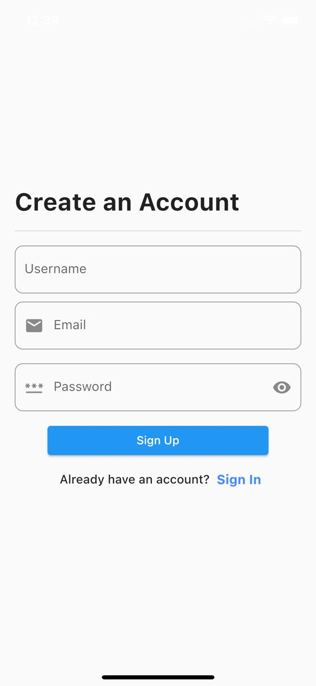 
    
    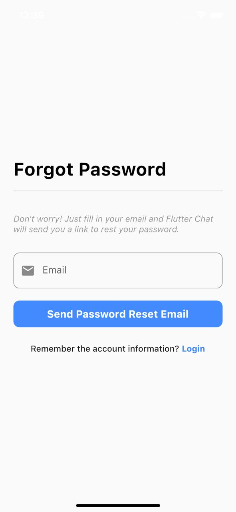 
    
    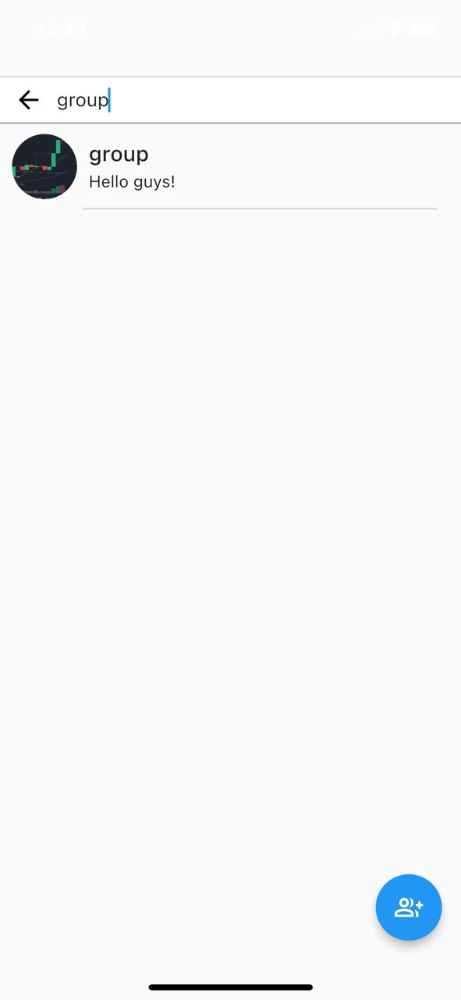 
  
  

## Technologies :
1. Flutter Bloc
2. Firebase Auth
3. Google Auth
4. Cloud Firestore
5. Firebase Storage
6. intl
7. get_it
8. cached_netowrk_image

## Features
1. SignIn - SignUp - Logout - Remember password
2. Google SignIn
3. Search by user name and group name
4. Real-time receive and send messages in groups or user chats
5. Viewing profile page and able to edit info and upload images

### # The Clean Architecture [proposed by our friendly Uncle Bob](https://blog.cleancoder.com/uncle-bob/2012/08/13/the-clean-architecture.html)

   
    

## Getting Started

This project is a starting point for a Flutter application.

A few resources to get you started if this is your first Flutter project:

- [Lab: Write your first Flutter app](https://docs.flutter.dev/get-started/codelab)
- [Cookbook: Useful Flutter samples](https://docs.flutter.dev/cookbook)

For help getting started with Flutter development, view the
[online documentation](https://docs.flutter.dev/), which offers tutorials,
samples, guidance on mobile development, and a full API reference.
